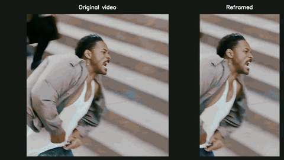

# AutoClip

Turn a 16:9 landscape video into a vertical video that follows the active speaker.
AutoClip detects faces, tracks them within each scene, scores who is speaking
with LR-ASD, and holds a stable crop around the selected person.

The output keeps the full video timeline and original source audio (re-encoded
to AAC). There is no clip selection, transcription, LLM, subtitle or overlay
stage in the normal reframing path.

## Demo

[](docs/assets/demo.mp4)

A 15 mins video takes around 2-3 mins for reframing.

## Quick start — Apple Silicon Mac

Install Python 3.12 and FFmpeg (for example, `brew install python@3.12 ffmpeg`).
From this repository's root:

```sh
python3.12 -m venv .venv
source .venv/bin/activate
python -m pip install -e '.[mac]'
python scripts/download_models.py --source upstream

autoclip doctor
autoclip run /path/to/video.mp4 --output out/my-video
```

That writes one file, `out/my-video/vertical.mp4`, and nothing else. Add
`--verbose` if you also want the analysis kept on disk — see
[What a run leaves behind](#what-a-run-leaves-behind).

Inputs must contain audio. The largest even-sized exact 9:16 crop is used (for
example, 1080p input produces 594×1056), with no upscaling unless you ask for
one with `--output-height 1920`. Analysis runs at 25 fps; add `--native-fps` to
render the result at the source's own frame rate.

### Face detection on macOS

**The default face detector is Apple's Vision framework** — the system
`VNDetectFaceRectanglesRequest`, supplied by macOS itself. It is selected by
`--detector vision`, which is the default, and it needs **no face weight file**
and no download: only the 3.3 MB LR-ASD speaking-detection checkpoint is
fetched by `scripts/download_models.py`, and that download is checksum-verified.
`autoclip doctor` confirms both that Vision is importable and that the fast
CoreVideo pixel-buffer path is available; without the latter AutoClip still
works, but face detection runs several times slower.

Install `python -m pip install -e '.[mac,yolo]'` and pass `--detector yolo`
to use the cross-platform YOLO face-and-person
checkpoint on a Mac instead. It is the only option off macOS, and it is also
what supplies the person boxes used to frame shots where no face is visible.

This folder is standalone: it can be copied out of the original workspace.
Locally supplied weights in `models/` are ignored by Git; a fresh clone obtains
them using the download command above. Run commands from the repository root,
or provide explicit model paths.

## Download and share the models

The two files are `models/pretrain_AVA.model` (ASD) and
`models/yolov8x_person_face.pt` (optional face/person detector).
The commands above download from the original sources and work before your
mirror is published. Once both files are uploaded to `shubhdotai/autoclip`:

```sh
python scripts/download_models.py                 # ASD only
python scripts/download_models.py --include-yolo  # both files
```

Downloads go into `models/` and are SHA-256 verified. Existing matching files
are reused. Use `--output` for another folder or `--repo` to change the mirror.
See [the upload guide](docs/HUGGINGFACE.md) and the ready-to-upload
[model card](docs/HF_MODEL_CARD.md). The card describes both models and their
separate upstream licenses; upload it to the Hub as `README.md`.

## Linux / Windows / CUDA

Use the optional YOLO face-and-person backend instead of Apple Vision:

```sh
python -m pip install -e '.[yolo]'
python scripts/download_models.py --source upstream --include-yolo
autoclip doctor --detector yolo
autoclip run /path/to/video.mp4 --detector yolo --output out/my-video
```

Install FFmpeg using your platform's package manager and ensure it is on PATH.
`--device auto` chooses MPS, CUDA, then CPU. Use `--device cpu` explicitly for
CPU runs. CUDA requires a compatible PyTorch installation. These non-Mac paths
are provided but have not been exercised on Linux/Windows/CUDA hardware.
The optional YOLO dependency and weights have separate terms; see
[model documentation](docs/MODELS.md).

## What a run leaves behind

`autoclip run` reframes the entire input as a vertical video, preserving its
duration. By default it writes **only `vertical.mp4`**. The 25 fps working copy and
the 16 kHz audio go to a scratch directory that is deleted on the way out, the
analysis is passed to the renderer in memory, and no JSON is produced.

`--verbose` keeps everything instead — every JSON artifact, `results.txt`, the
per-frame crop plan, `_work/` with the normalized media, and a per-stage timing
profile on the console. Use it when you want to inspect what the pipeline
decided. It uses the same reframing settings as a normal run.

```sh
autoclip run /path/to/video.mp4 --output out/my-video            # vertical.mp4 only
autoclip run /path/to/video.mp4 --output out/my-video --verbose  # + full analysis
```

## Analyze once, render again

```sh
autoclip analyze /path/to/video.mp4 --output out/analysis
autoclip render /path/to/video.mp4 --output out/analysis
```

These two exist to produce and to consume artifacts, so they always write them;
`--verbose` does not apply. Keep `_work/` until you finish rendering: it
contains the normalized video and audio. `--debug-video` adds separate diagnostic face/speaker videos; the final vertical
video has no overlays.
`autoclip --help` and `autoclip run --help` list supported options.

## Project map

| Path | Purpose |
| --- | --- |
| `src/autoclip/` | Supported Python CLI and processing pipeline |
| `src/autoclip/scan.py` | Fused scene + face detection over one decode pass |
| `src/autoclip/gating.py` | Decides which tracks need active-speaker scoring |
| `src/autoclip/model/` | Original LR-ASD architecture and checkpoint names |
| `models/` | Local weights, download manifest; binaries excluded from Git |
| `scripts/` | Checksum-verified downloads for the two checkpoints |
| `research/tracking/` | Separate ByteTrack + face identity experiment |
| `tests/` | Tracking, framing, inference and media regression tests |
| `docs/` | Architecture, model inventory, migration audit and validation record |

## Useful options

| Flag | What it does |
| --- | --- |
| `--verbose` | Keep the analysis artifacts and print the stage profile. Off by default. |
| `--score-all-tracks` | Score every track, not just the ones whose result can change the crop. Slower; produces a complete speaking report. |
| `--native-fps` | Render from the original source at its own frame rate, skipping the 25 fps intermediate and its generation loss. |
| `--output-height 1920` | Scale the finished crop to a platform-native height instead of shipping the raw crop size. |
| `--motion follow` | Ease the camera toward a subject who drifts out of a deadzone, instead of holding one fixed crop per shot. |
| `--scene-mode adaptive` | Use PySceneDetect's adaptive detector, which is far less prone to false cuts on fast motion and camera flashes. |
| `--speaker-margin 0.5` | Require the top speaker to lead the runner-up before the camera switches. |
| `--min-face-conf`, `--min-face-fraction` | Drop low-confidence or tiny detections before they can become tracks. |
| `--sample-every 3` | Detect faces less often; tracking interpolates between detections. |

## Performance

### Mac M3 Pro timing

In a run reported by the project author, a **15-minute video** was reframed
in **2 minutes 30 seconds** on a **Mac M3 Pro** — **6× real-time throughput**.
This is a single observed result; processing time varies with video resolution,
scene complexity, detector and settings.

With `--verbose`, each stage prints its elapsed time and `run.json` records
the profile. On
a 147 s 1080p60 clip with 115 scenes and 99 tracks, on an Apple Silicon Mac,
end-to-end run time went from 125 s to 41 s. The work is overwhelmingly I/O
rather than neural network: the LR-ASD visual encoder runs at about 1900
frames/s on MPS, so the model itself accounts for a couple of seconds.

The largest wins were dropping the per-frame PNG encode in front of Apple
Vision in favour of a CVPixelBuffer at reduced resolution, fusing the scene and
face passes into one overlapped decode, removing the per-track FFmpeg calls and
MP4 round-trip, and skipping active-speaker scoring for tracks whose result
cannot move the crop.

## Long videos and limitations

Face crops stream into a batched encoder rather than being written to disk and
read back, so per-track media never accumulates. The encoder holds at most one
window per open track. Metadata, audio, embeddings and frame plans still grow
with duration; the whole pipeline is **not constant-memory**. A
60-minute performance or accuracy guarantee has not been established here.
See [architecture](docs/ARCHITECTURE.md) and [validation](docs/VALIDATION.md).

The pipeline uses **PyTorch** (MPS/CUDA/CPU) and the default
`models/pretrain_AVA.model` checkpoint. Mainline tracking is scene-aware IoU. ByteTrack is preserved as
research, not silently substituted into the ASD pipeline.

## Development and attribution

```sh
python -m pip install -e '.[mac,dev]'
pytest
```

See [CONTRIBUTING.md](CONTRIBUTING.md), [migration audit](docs/MIGRATION.md),
[model inventory](docs/MODELS.md).
Derived LR-ASD code retains its upstream MIT notice in [LICENSE](LICENSE).
Credit and paper citations are in [THIRD_PARTY_NOTICES.md](THIRD_PARTY_NOTICES.md).
